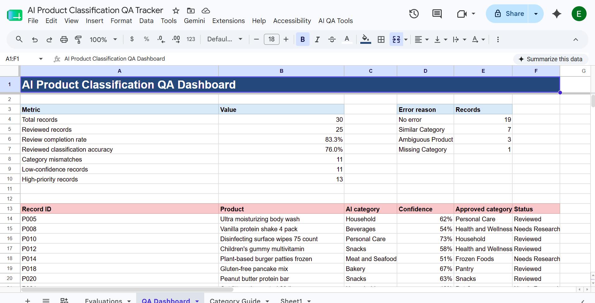
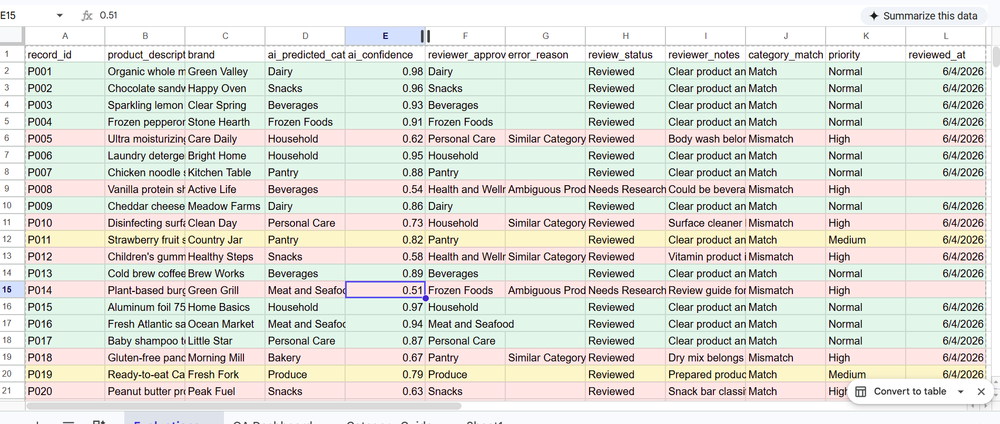
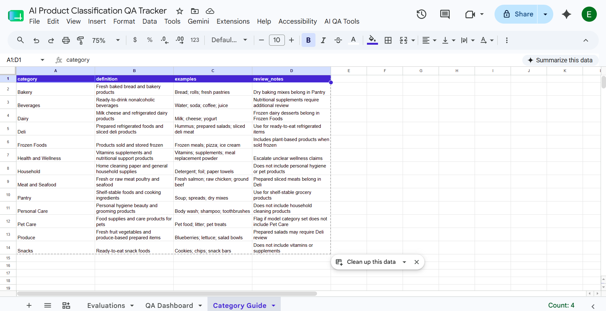

# AI Product Classification QA Tracker

## Scenario

A retail rewards platform uses AI to classify product records. AI Operations reviewers need a reliable way to evaluate predictions, label ambiguous records, follow category guidelines, and identify recurring model-quality issues.

I built a Google Sheets and Apps Script workflow that turns a manual review spreadsheet into a prioritized AI quality-assurance queue and reporting dashboard.

## Project Outcome

The workflow:

- compares AI-predicted categories with reviewer-approved labels
- flags category disagreements and low-confidence predictions
- prioritizes ambiguous records for human research
- tracks review completion and timestamps
- summarizes classification accuracy and recurring error reasons
- gives reviewers a custom `AI QA Tools` menu in Google Sheets

## Business Results From the Sample Review

| Metric | Result |
|---|---:|
| Product records evaluated | 30 |
| Records completed by reviewers | 25 |
| Review completion rate | 83.3% |
| Accuracy across reviewed records | 76.0% |
| Category disagreements identified | 11 |
| Low-confidence predictions | 11 |
| High-priority review records | 13 |

These metrics show why human review is valuable: the workflow surfaces confident-looking category errors, unclear products, and missing category coverage before those issues affect downstream systems. Six disagreements were resolved in completed reviews, while five remain in the research queue.

## Project Preview

### QA Dashboard



### Prioritized Review Queue



### Category Review Guide



## Downloadable Workbook

[Download the completed AI Product Classification QA Tracker workbook](AI_Product_Classification_QA_Tracker.xlsx)

The workbook contains the completed evaluation queue, QA dashboard, and category guide. Google Apps Script automation is provided separately in [`apps-script/Code.gs`](apps-script/Code.gs) because Apps Script does not run inside downloaded Excel workbooks.

## Tools

| Area | Tools |
|---|---|
| Review workflow | Google Sheets |
| Automation | Google Apps Script / JavaScript |
| Data validation | Reviewer-approved category guide |
| Supporting analysis | Python |
| Documentation | README, setup guide, case study, interview Q&A |

## Google Apps Script Features

| Feature | Purpose |
|---|---|
| `Set up workbook` | Creates and formats the required tabs |
| `Recalculate QA flags` | Evaluates every record using consistent rules |
| `Refresh QA dashboard` | Calculates accuracy, completion, issues, and review queue |
| `Assign next review item` | Navigates to the next unresolved high-priority record |
| `onEdit` automation | Recalculates a record when a reviewer changes it |

## Priority Logic

| Priority | Rule |
|---|---|
| High | Needs research, missing approved label, category mismatch, or confidence below 70% |
| Medium | Confidence below 85% or a documented error reason |
| Normal | Reviewed category match with strong confidence |

## Project Structure

```text
ai-product-classification-qa-tracker/
|-- apps-script/
|   |-- Code.gs
|   `-- appsscript.json
|-- data/
|   |-- category_guide.csv
|   `-- sample_product_evaluations.csv
|-- outputs/
|-- src/
|   `-- analyze_qa.py
|-- CASE_STUDY.md
|-- GOOGLE_SHEETS_SETUP.md
`-- INTERVIEW_QA.md
```

## Run the Supporting Analysis

```powershell
python src\analyze_qa.py
```

## What This Demonstrates

- evaluating AI and automation outputs for accuracy and consistency
- data annotation and reviewer-approved labels
- research queues for ambiguous products
- QA workflow design and SOP-based decision rules
- Google Sheets automation with Apps Script
- retail and e-commerce product classification
- communicating model-quality metrics to operations teams

## Limitations

The product records and predictions are realistic synthetic examples. The workflow uses rule-based review prioritization rather than a live product-recognition model. In production, I would connect model outputs and catalog data through APIs, add reviewer identity and inter-annotator agreement metrics, and monitor quality trends by model version.
