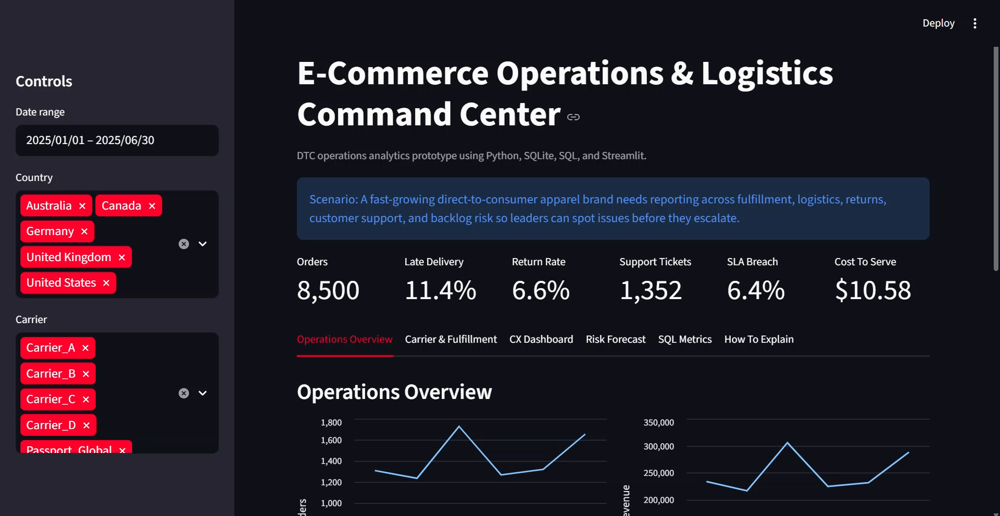
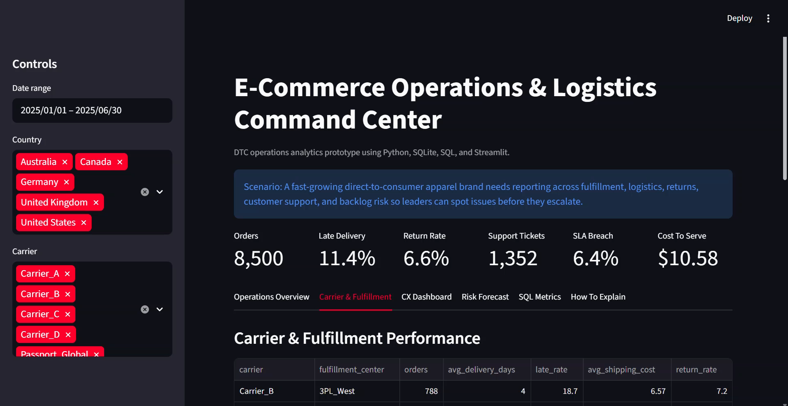
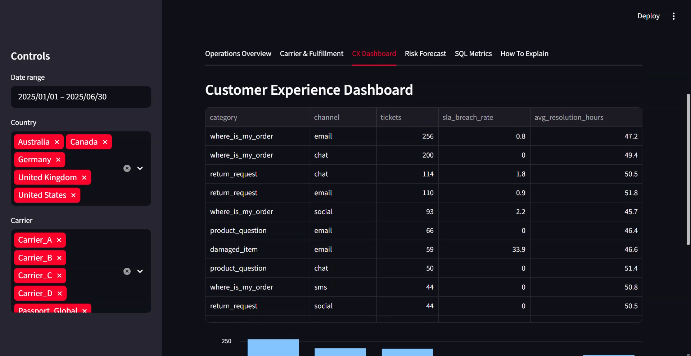
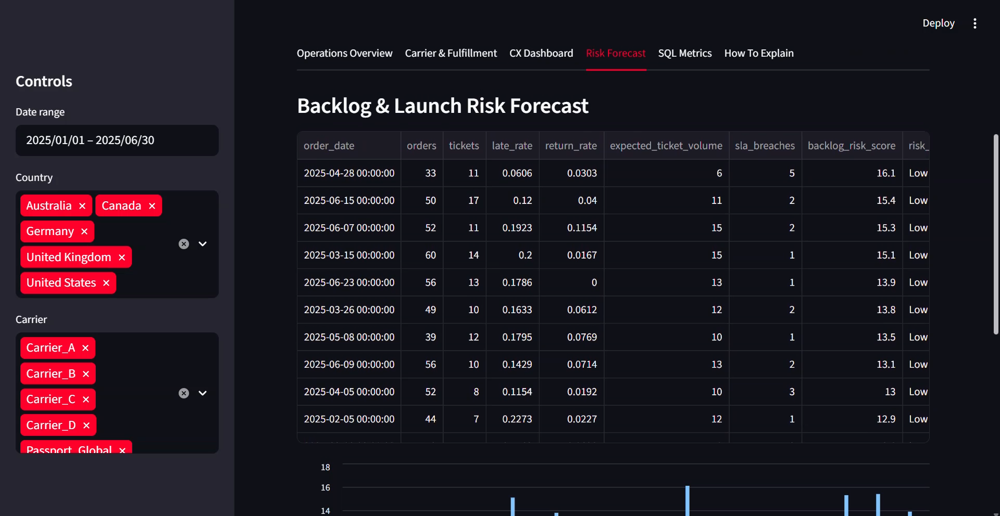

# E-Commerce Operations & Logistics Dashboard

## Scenario

A fast-growing direct-to-consumer apparel brand needs a reporting system that connects fulfillment, logistics, returns, customer support, and backlog risk. Leadership wants to identify operational issues before they escalate and understand how carrier performance, return rates, and CX ticket volume affect cost to serve.

This project is inspired by operations and logistics data analyst job descriptions for DTC/e-commerce brands.

## Project Outcome

I built a Streamlit dashboard backed by SQLite that shows:

- order volume and revenue trends
- late delivery rate
- return rate
- carrier and fulfillment-center performance
- support ticket volume and SLA breaches
- contact drivers and agent workload
- backlog risk score and recommended actions
- SQL examples for operational metrics

## Screenshots

### Operations Overview



### Carrier & Fulfillment



### Customer Experience Dashboard



### Backlog & Launch Risk Forecast



## Why Synthetic Data?

Real 3PL, carrier, WMS, and customer support exports are usually private. This project uses synthetic but realistic operational data to model the same kind of tables an analyst would receive from platforms such as 3PL systems, carriers, Gorgias/Zendesk-style CX platforms, and internal order systems.

## Tools

| Area | Tools |
|---|---|
| Data generation | Python, pandas, NumPy |
| Database | SQLite |
| Dashboard | Streamlit |
| Analytics | SQL, KPI logic, risk scoring |
| Documentation | README, case study, interview Q&A |

## Dashboard Tabs

| Tab | Business Question |
|---|---|
| Operations Overview | Are orders, revenue, late deliveries, and returns trending in the right direction? |
| Carrier & Fulfillment | Which carriers or fulfillment centers are creating cost, delay, or quality issues? |
| CX Dashboard | What is driving support tickets, SLA breaches, and agent workload? |
| Risk Forecast | Which days show backlog risk and what action should leadership take? |
| SQL Metrics | What queries validate the dashboard metrics? |
| How To Explain | How would I communicate the project in an interview? |

## Data Model

| Table | Description |
|---|---|
| `orders` | order-level data including product, country, carrier, fulfillment center, shipping cost, late delivery, and returns |
| `support_tickets` | CX tickets connected to orders, with category, channel, agent, SLA, sentiment, and status |
| `daily_operations` | daily order volume, ticket volume, expected ticket volume, and backlog risk score |

## Key Metrics

- Orders
- Late delivery rate
- Return rate
- Support ticket volume
- SLA breach rate
- Average shipping cost
- Cost to serve
- Backlog risk score

## How To Run

```powershell
python src\generate_data.py
python -m streamlit run src\app.py
```

## What This Demonstrates

This project demonstrates:

- dashboard development for operations and logistics
- SQL reporting logic
- CX analytics and SLA reporting
- carrier and fulfillment performance analysis
- cost-to-serve thinking
- data-backed risk flagging
- clear business communication for leadership

## Limitations

This is a portfolio prototype, not a production logistics system. The data is synthetic, and the forecast is a simple rules-based risk score rather than a trained machine learning model. In a real company, I would connect this dashboard to actual order, WMS, carrier, returns, and CX platform data feeds.
