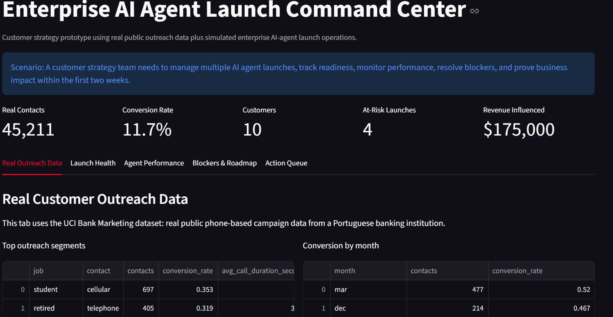
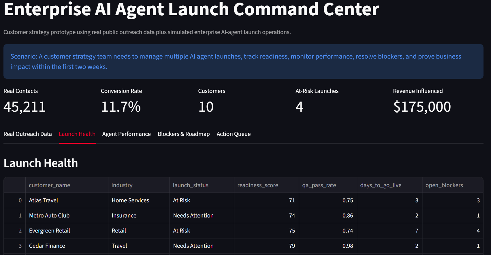
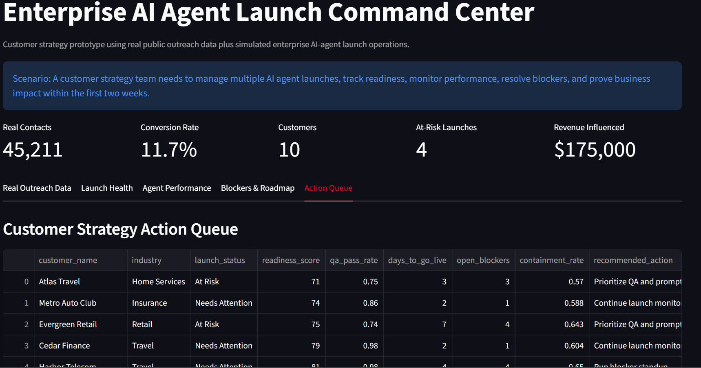

# Enterprise AI Agent Launch Command Center

## Scenario

An AI agent platform is launching customer communication agents for enterprise clients. Each customer launch needs to move quickly from kickoff to go-live while tracking readiness, quality, business impact, and unresolved blockers.

This project is the outcome of that scenario: a free, local command center for customer AI agent deployments. It combines real public customer-contact data with a simulated enterprise launch operations layer.

Full case study: [CASE_STUDY.md](CASE_STUDY.md)

Interview preparation notes: [INTERVIEW_QA.md](INTERVIEW_QA.md)

Step-by-step build guide: [BUILD_STEPS.md](BUILD_STEPS.md)

## Project Goal

This project was designed from an AI Customer Strategy job description. The role asked for customer launches, AI agent deployments, success metrics, stakeholder management, implementation playbooks, roadmap feedback, and working knowledge of APIs/data flows/light coding.

The goal is to show how I would manage and monitor several enterprise AI agent launches at once.

## Job Description Match

| Job Requirement | How This Project Demonstrates It |
|---|---|
| Own customer launches | Tracks multiple customer deployments from kickoff to go-live |
| Define success metrics | Monitors real outreach conversion, containment rate, escalations, revenue influenced, and time saved |
| Manage launch quality | Uses readiness scores, QA pass rates, and blocker tracking |
| AI agent monitoring | Tracks intents, failed calls, handoff reasons, and customer sentiment |
| Implementation playbooks | Includes a 14-day launch plan and reusable checklist |
| Roadmap feedback | Converts launch issues into product/AI improvement recommendations |
| Analytical decision-making | Uses SQL and dashboard metrics to prioritize customer risk |
| Light coding / data flows | Uses Python, CSV data, SQLite, and Streamlit |

## Free Tools Used

- Python
- SQLite
- SQL
- Streamlit
- pandas
- GitHub

No paid API is required.

## Data Sources

| Data | Source | How It Is Used |
|---|---|---|
| Real customer-contact data | UCI Bank Marketing dataset | Outreach conversion analysis, contact strategy, customer segment performance |
| Simulated launch operations data | Generated locally with Python | Customer kickoff, readiness, blockers, QA, AI-agent monitoring, and launch actions |

The UCI Bank Marketing dataset contains real direct marketing campaign records based on phone calls from a Portuguese banking institution. The target field indicates whether a customer subscribed to a term deposit. Source: [UCI Machine Learning Repository - Bank Marketing](https://archive.ics.uci.edu/dataset/222/bank).

## What The Project Does

1. Downloads and prepares real public customer-contact data.
2. Generates synthetic customer launch and AI agent performance data.
3. Builds a local SQLite database.
4. Calculates outreach conversion, launch readiness, and business impact metrics.
5. Flags at-risk customer deployments.
6. Recommends next actions for the customer strategy team.
7. Shows roadmap insights from unresolved intents and launch blockers.

## Project Structure

```text
enterprise-ai-agent-launch-command-center/
  README.md
  BUILD_STEPS.md
  CASE_STUDY.md
  INTERVIEW_QA.md
  requirements.txt
  data/
    customers.csv
    launches.csv
    agent_calls.csv
    blockers.csv
    bank_marketing_contacts.csv
    launch_command_center.db
  sql/
    launch_metrics.sql
  src/
    generate_data.py
    download_real_data.py
    build_database.py
    launch_advisor.py
    app.py
```

## How To Run

From this project folder:

```bash
python src/download_real_data.py
python src/generate_data.py
python src/build_database.py
python -m streamlit run src/app.py
```

## Demo Screenshots

### Real Outreach Data



### Launch Health



### Customer Strategy Action Queue



## Portfolio Story

This project shows how I can translate an AI customer strategy role into a working implementation workflow. It combines real customer outreach analytics, launch planning, customer success metrics, AI agent monitoring, SQL analytics, and executive-ready communication.
