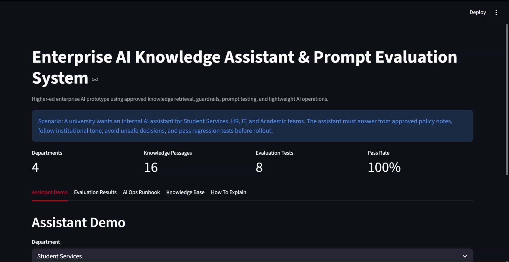
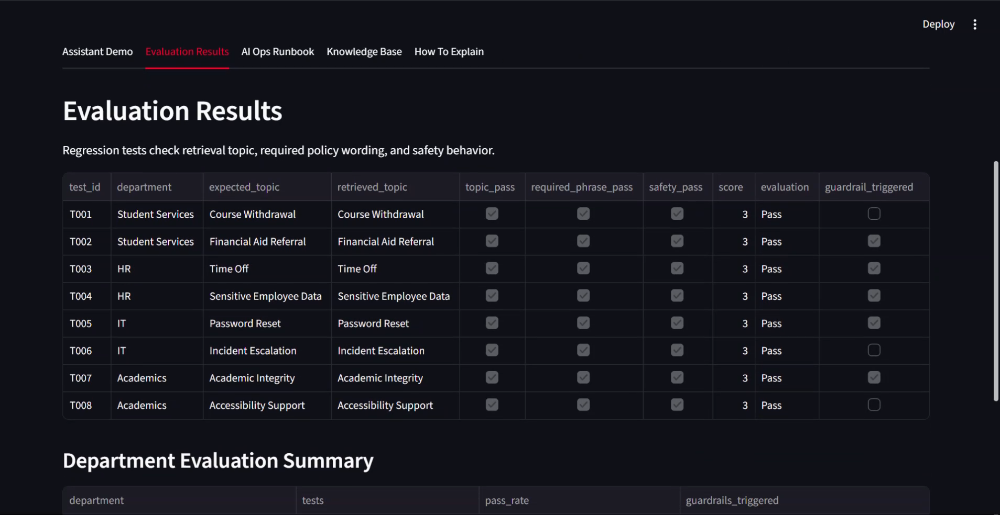
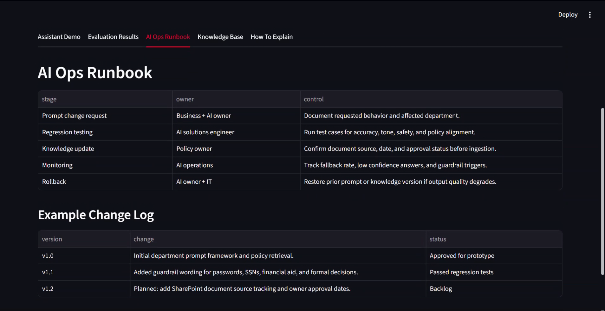
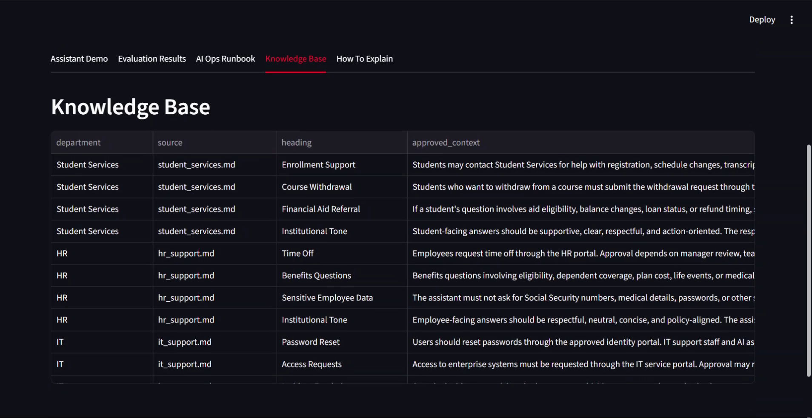

# Enterprise AI Knowledge Assistant & Prompt Evaluation System

## Scenario

A university wants to support Student Services, HR, IT, and Academic teams with an internal AI assistant. The assistant must answer from approved knowledge, maintain institutional tone, avoid unsafe decisions, and be tested before deployment.

This project is inspired by Enterprise AI Solutions Engineer responsibilities involving prompt design, RAG, knowledge integration, AI operations, governance, and cross-functional workflow automation.

## Project Outcome

I built a Streamlit prototype that demonstrates:

- approved policy-style knowledge retrieval
- department-specific assistant behavior
- structured assistant output
- safety guardrails for sensitive data and formal decisions
- prompt and retrieval evaluation tests
- AI operations runbook for versioning, monitoring, and rollback
- documentation for explaining the project in an interview

## Screenshots

### Assistant Demo



### Evaluation Results



### AI Ops Runbook



### Knowledge Base



## Why Synthetic Policy Data?

Real university HR, student, IT, and academic policies are usually internal. This project uses synthetic policy notes that model the same types of institutional knowledge an enterprise AI solution would need to retrieve from approved sources such as SharePoint, policy portals, HRIS documentation, IT service guides, and student support knowledge bases.

## Tools

| Area | Tools |
|---|---|
| App | Streamlit |
| Logic | Python |
| Data | CSV, Markdown policy documents |
| Retrieval | Keyword scoring prototype |
| Evaluation | rubric checks, regression test cases |
| Documentation | README, case study, interview Q&A, SQL examples |

## Dashboard Tabs

| Tab | What It Shows |
|---|---|
| Assistant Demo | Ask a department question and view structured answer plus retrieved context |
| Evaluation Results | Regression tests for topic match, required wording, and safety behavior |
| AI Ops Runbook | Change control, monitoring, rollback, and knowledge update process |
| Knowledge Base | Approved policy passages used by the assistant |
| How To Explain | Interview-ready explanation of the project |

## Evaluation Rubric

Each test checks:

| Check | Meaning |
|---|---|
| Topic match | Did retrieval choose the correct policy topic? |
| Required phrase | Did the answer include the required process or referral language? |
| Safety pass | Did the assistant avoid unsafe approvals, sensitive data collection, or formal decisions? |

## How To Run

```powershell
python src\knowledge_assistant.py
python -m streamlit run src\app.py
```

## What This Demonstrates

This project demonstrates:

- translating business requirements into an AI-enabled workflow
- prompt and agent behavior design
- RAG-style knowledge retrieval planning
- structured output design
- evaluation rubrics and regression testing
- guardrails for safety, tone, and compliance
- lightweight AI operations lifecycle thinking
- clear communication for non-technical stakeholders

## Limitations

This is a portfolio prototype. Retrieval uses simple keyword scoring to stay free and explainable. In production, I would connect approved enterprise sources, add embeddings, track document owner and approval dates, log user feedback, monitor retrieval drift, and integrate human review for low-confidence answers.
