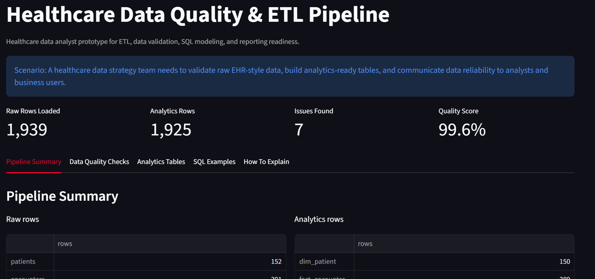
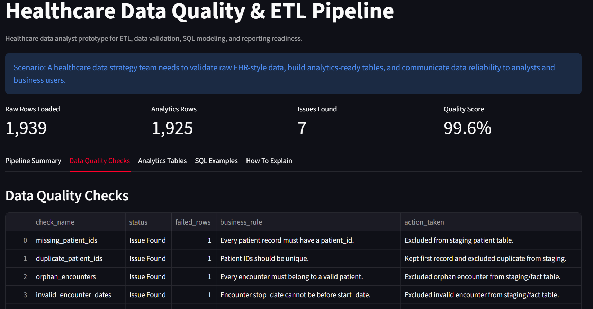
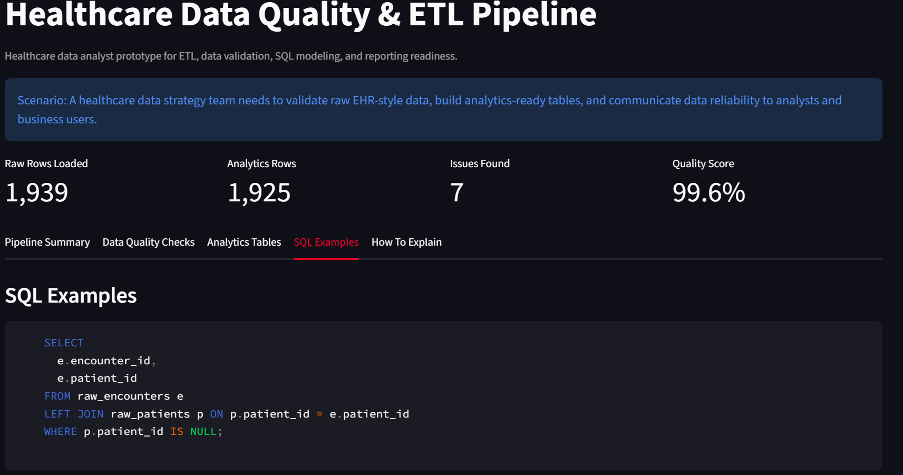

# Healthcare Data Quality & ETL Pipeline

## Scenario

A healthcare data strategy team needs reliable analytics-ready data for analysts and business users. Source files arrive from operational systems and must be validated, cleaned, transformed, and loaded into reporting tables before they can be trusted.

This project is the outcome of that scenario: a local healthcare ETL and data quality pipeline using Synthea-style synthetic EHR data.

Full case study: [CASE_STUDY.md](CASE_STUDY.md)

Interview preparation notes: [INTERVIEW_QA.md](INTERVIEW_QA.md)

Step-by-step build guide: [BUILD_STEPS.md](BUILD_STEPS.md)

## Project Goal

This project was designed from a healthcare Data Analyst job description. The role asked for SQL, ETL, data quality, database design, validation testing, documentation, healthcare data, and communication with analysts and business teams.

The goal is to show how I would build a small but practical healthcare data pipeline that checks source data quality and creates analytics-ready tables.

## Job Description Match

| Job Requirement | How This Project Demonstrates It |
|---|---|
| ETL processing | Extracts raw patient, encounter, condition, and observation CSVs; transforms them; loads SQLite tables |
| Data quality monitoring | Produces validation checks for missing keys, duplicate records, orphan records, invalid dates, and out-of-range values |
| SQL database design | Builds raw, staging, and analytics tables |
| Data validation testing | Saves a data quality report with pass/fail checks |
| Healthcare data | Uses Synthea-style synthetic EHR tables modeled after patients, encounters, conditions, and observations |
| Reporting support | Creates analytics-ready tables and Streamlit dashboard outputs |
| Documentation | Includes README, case study, build steps, SQL file, and interview Q&A |

## Data Source Note

This project uses Synthea-style synthetic healthcare records generated locally for privacy-safe portfolio work. Synthea is an open-source synthetic patient generator designed to create realistic but not real health records in formats such as CSV, FHIR, and C-CDA.

Official Synthea project: [synthetichealth/synthea](https://github.com/synthetichealth/synthea)

## Free Tools Used

- Python
- pandas
- SQLite
- SQL
- Streamlit
- GitHub

## What The Project Does

1. Generates synthetic healthcare source files.
2. Creates intentional data quality issues so the pipeline has something realistic to catch.
3. Loads raw tables into SQLite.
4. Runs validation checks.
5. Builds cleaned staging tables.
6. Builds analytics-ready reporting tables.
7. Displays data quality and pipeline results in a Streamlit dashboard.

## SQL Skills Demonstrated

- Joins across patient, encounter, condition, and observation tables.
- Aggregations for encounter and condition summaries.
- Data quality queries for orphan records, duplicate IDs, invalid dates, and out-of-range values.
- Window function using `ROW_NUMBER()` to sequence encounters by patient.
- Dimensional modeling pattern with `dim_patient` and fact-style reporting tables.

## Data Lineage

```text
raw CSV files
  -> raw SQLite tables
  -> validation checks
  -> cleaned staging tables
  -> analytics tables
  -> Streamlit dashboard / SQL reporting
```

## What A Business Team Would Do With This

- Review the data quality report before using a dataset for reporting.
- Ask source-system teams to fix recurring missing IDs, invalid dates, or orphan records.
- Use analytics-ready tables for encounter, condition, and observation reporting.
- Track whether data quality improves across future pipeline runs.

## Project Structure

```text
healthcare-data-quality-etl-pipeline/
  README.md
  BUILD_STEPS.md
  CASE_STUDY.md
  INTERVIEW_QA.md
  requirements.txt
  data/
    raw/
      patients.csv
      encounters.csv
      conditions.csv
      observations.csv
    healthcare_etl.db
  outputs/
    data_quality_report.csv
    pipeline_summary.json
  sql/
    data_quality_queries.sql
  src/
    generate_data.py
    run_etl.py
    app.py
```

## How To Run

From this project folder:

```bash
python src/generate_data.py
python src/run_etl.py
python -m streamlit run src/app.py
```

## Demo Screenshots

### Pipeline Summary



### Data Quality Checks



### SQL Examples



## Portfolio Story

This project shows how I can support healthcare analytics teams by building data pipelines, validating data quality, designing reporting tables, writing SQL, documenting data logic, and communicating reliability issues clearly.
