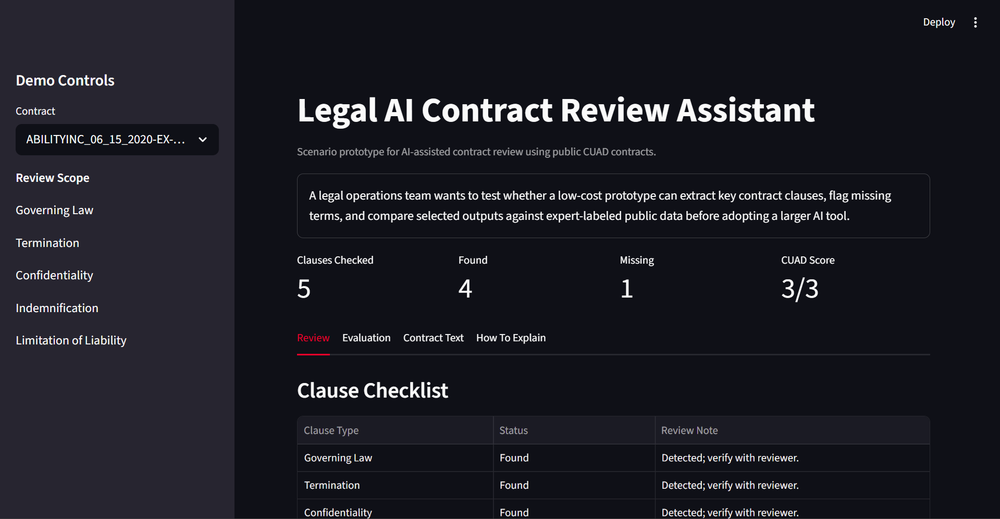
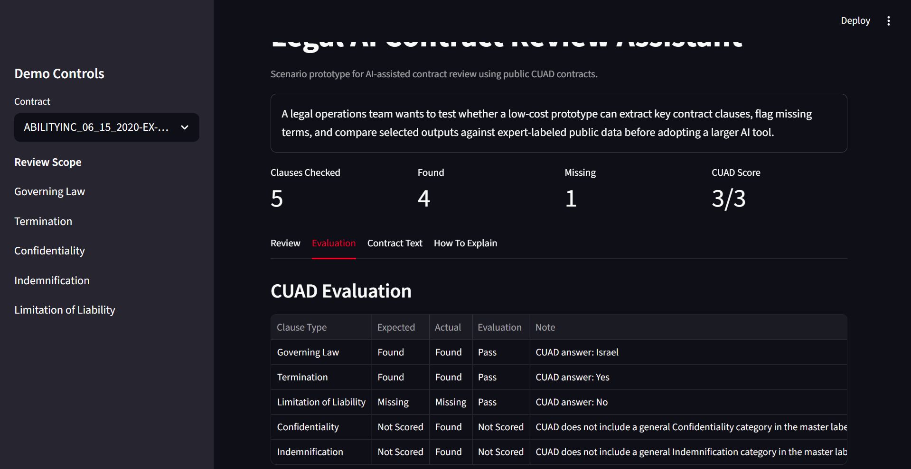

# Legal AI Contract Review Assistant

## Scenario

A legal operations team is exploring whether AI-assisted contract review could help lawyers and paralegals review routine commercial agreements faster. Before adopting a larger tool, the team needs a small prototype that can extract important clauses, flag missing terms, and compare results against expert-labeled public data.

This project is the outcome of that scenario: a free, local contract review prototype built with public CUAD contracts and transparent rule-based evaluation.

Full case study: [CASE_STUDY.md](CASE_STUDY.md)

Interview preparation notes: [INTERVIEW_QA.md](INTERVIEW_QA.md)

## Project Goal

This project started from a legal innovation job description. I wanted to understand what "AI-powered contract review" actually means, then build a small working version using free public data.

The project is designed around roles that ask for support with AI-powered legal technologies, contract review, clause extraction, workflow automation, document summarization, user feedback, and evaluation.

The goal is to build a practical tool that can review a contract, identify important clauses, summarize key terms, and define a feedback loop so the workflow can improve over time.

## Job Description Match

| Job Requirement | How This Project Demonstrates It |
|---|---|
| Contract review | Extracts and organizes important contract clauses |
| Clause extraction | Identifies clauses such as termination, confidentiality, governing law, indemnification, and limitation of liability |
| Document summarization | Produces a plain-English contract summary |
| AI workflow automation | Turns contract text into structured review output |
| Testing and validation | Compares extracted clauses against expected examples from public datasets |
| User feedback | Includes a plan for lawyer/paralegal ratings and comments |
| Adoption metrics | Defines metrics such as review time, missing clauses, flagged risks, and usefulness ratings |
| Privacy and security awareness | Uses public sample contracts first and avoids confidential client documents |

## Current Scope

The first version focuses on five clause types:

1. Governing Law
2. Termination
3. Confidentiality
4. Indemnification
5. Limitation of Liability

The first version uses a small sample of public contracts so the project stays free and manageable.

## Free Data Plan

Primary dataset:

- CUAD: Contract Understanding Atticus Dataset
- Public dataset of commercial contracts with expert-labeled clauses
- Includes 510 contracts and 41 clause categories
- License: CC BY 4.0

Possible later data source:

- SEC EDGAR contract exhibits for additional real-world public contracts

## Dataset Notes

For this project, I chose the CUAD dataset from The Atticus Project because it is a public legal contract dataset designed for contract review tasks.

CUAD includes 510 commercial legal contracts, more than 13,000 expert-created clause labels, and 41 clause categories. The dataset includes full contract text files, PDFs, a master clauses CSV, and a SQuAD-style JSON file.

For the first version of this project, I am limiting the scope to five clause types:

- Governing Law
- Termination
- Confidentiality
- Indemnification
- Limitation of Liability

This keeps the project focused and easier to evaluate before expanding to more clause categories.

The first real CUAD sample added to this project is:

- `ABILITYINC_06_15_2020-EX-4.25-SERVICES_AGREEMENT.txt`

This sample helped improve the first rule-based extractor. The initial baseline detected the correct clause categories, but one result showed why legal text needs careful validation: a keyword search can match a clause mention inside the wrong section. I updated the extractor to prefer clause headings before searching the full body text.

## Planned Features

| Feature | Description | Status |
|---|---|---|
| Contract text loader | Load sample contract text files | Complete |
| Clause extractor | Find target clauses in contract text | Complete |
| Contract summary | Generate a plain-English summary of key terms | Complete |
| Risk notes | Flag missing or potentially risky clauses | Complete |
| Review report | Export structured results as Markdown or JSON | Complete |
| CUAD evaluation | Compare selected extracted clauses to CUAD labels | Complete |
| Streamlit demo | Explore contract review results in a simple web app | Complete |
| Feedback tracker | Store reviewer ratings and comments | Planned |

## First Technical Approach

To keep the project free, the first version will use Python and open-source tools before adding any paid AI API.

Possible tools:

- Python
- pandas
- regex and rule-based baselines
- sentence-transformers for semantic matching
- SQLite for local results
- Streamlit for a simple demo app

Current v1 uses Python, regex/rule-based extraction, JSON outputs, Markdown reports, and Streamlit for the demo app.

## Example Output

```text
Contract: sample_agreement_01.txt

Detected Clauses:
- Governing Law: Found
- Termination: Found
- Confidentiality: Found
- Indemnification: Needs review
- Limitation of Liability: Missing

Plain-English Summary:
This agreement includes confidentiality obligations, a termination section, and a governing law clause. The limitation of liability clause was not detected and should be reviewed by a legal professional.
```

## How to Run V1

From this project folder, run:

```bash
python src/contract_review.py
```

The script reviews the sample contract in `data/sample_contracts/` and saves two outputs:

- `outputs/review_report.md`
- `outputs/review_results.json`

To run the first CUAD sample:

```bash
python src/contract_review.py --contract data/cuad_samples/ABILITYINC_06_15_2020-EX-4.25-SERVICES_AGREEMENT.txt --output-dir outputs/cuad_ability_services_agreement
```

To evaluate the CUAD sample against the extracted answer key:

```bash
python src/evaluate_review.py
```

The evaluation report is saved to:

- `outputs/cuad_ability_services_agreement/evaluation_report.md`

Current scored result:

```text
ABILITYINC Services Agreement: 3 of 3
Conformis Development Agreement: 2 of 3
Cerence Intellectual Property Agreement: 3 of 3
```

The Conformis mismatch is useful: CUAD scores "Termination For Convenience" specifically, while this project's current detector identifies broader termination language. That distinction is documented as a next improvement.

## Streamlit Demo

Install the project requirements:

```bash
pip install -r requirements.txt
```

Run the app:

```bash
streamlit run src/app.py
```

The app lets a reviewer select a sample contract, view clause status counts, inspect extracted clauses, and see the JSON output.

## Demo Screenshots

### Review Workflow



### CUAD Evaluation



## Portfolio Story

This project shows how I can take a legal operations job description and turn it into a working AI/data workflow. It combines technical implementation with requirements analysis, evaluation, documentation, and a practical understanding of how legal teams might adopt new tools.
