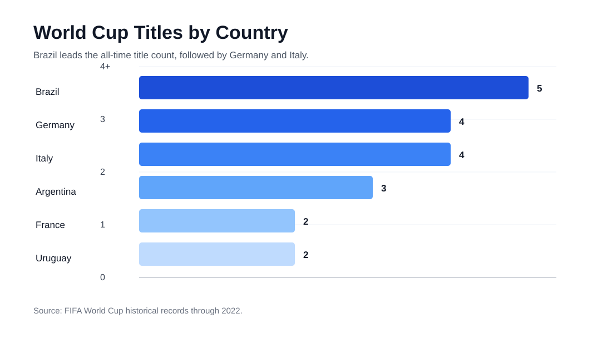
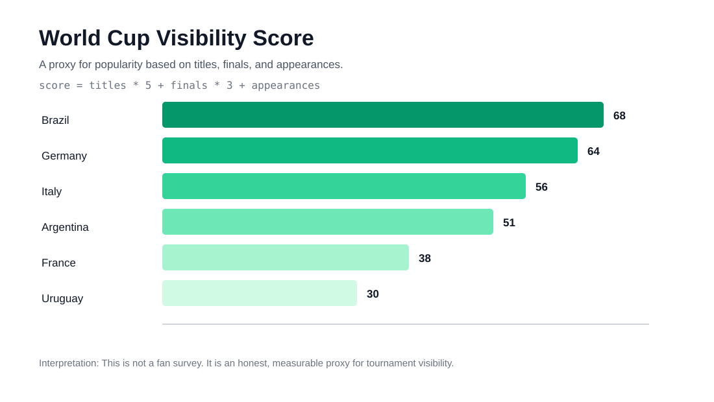
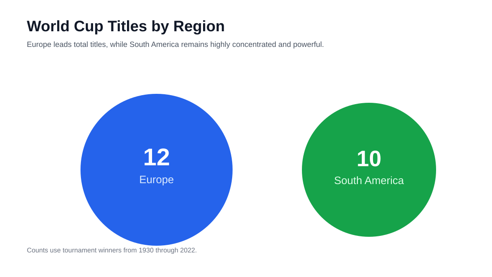
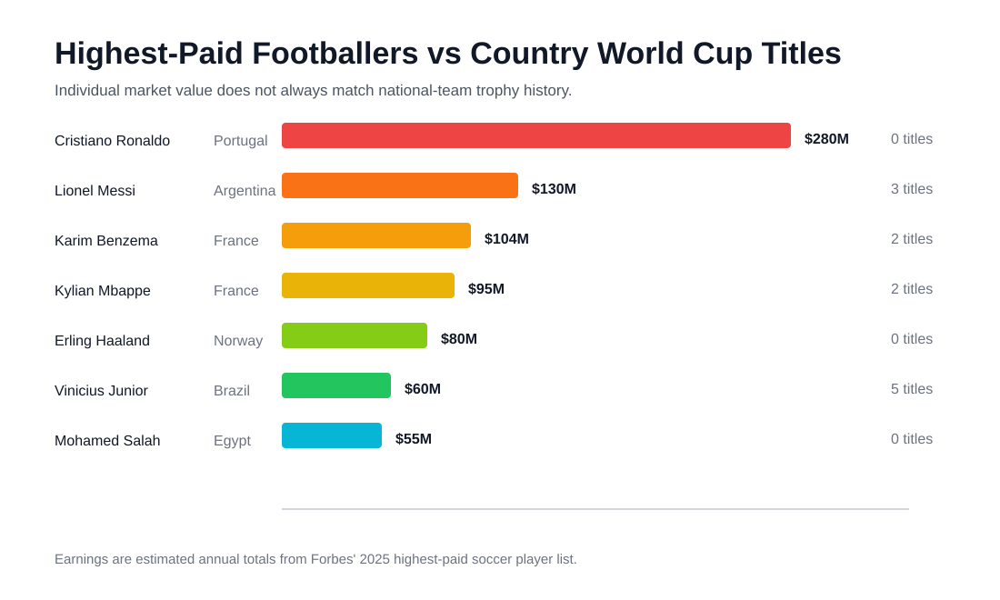

# FIFA World Cup Analysis Report

This report is a readable version of the notebook for recruiters who want the story first and the code second.

## Executive Summary

Brazil is the strongest country by World Cup titles, Germany is the strongest consistency story by finals appearances, and Europe leads South America in total tournament wins. The analysis also shows that the highest-paid footballers do not always come from the countries with the most World Cup wins, which separates individual market value from national team dominance.

## 1. Title Leaders

Brazil leads the tournament historically with five titles. Germany and Italy follow closely with four titles each, while Argentina strengthened its position with the 2022 win.

## 2. Visibility Score

I used a visibility score instead of simply saying "popular teams" because popularity is not one single metric. This score rewards countries that repeatedly appear, reach finals, and win tournaments.

## 3. Regional Dominance

Europe has won more World Cups overall, but South America remains highly competitive because Brazil, Argentina, and Uruguay have a concentrated history of success.

## 4. Player Earnings Context

Player earnings reflect club contracts, sponsorships, league economics, and personal brand value. They do not perfectly predict national team success.

## Final Takeaway

The strongest portfolio insight is not just "Brazil won the most." It is that different metrics tell different stories:

- Titles show dominance.
- Finals show consistency.
- Appearances show visibility.
- Player earnings show business value.

That is the kind of distinction a data analyst should be able to explain.
